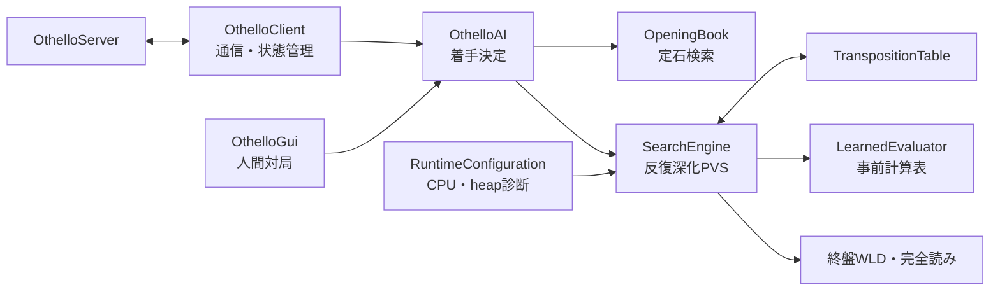

# Othello通信AI 技術レポート

| 項目 | 内容 |
|---|---|
| 対象 | [mesinoou/OthelloClient](https://github.com/mesinoou/OthelloClient) |
| 基準コミット | `2edc476` |
| 最終大会構成 | `TOURNEY-002` |
| 作成日 | 2026-07-24 |
| 実装言語 | Java 11、学習系はPython 3 |

## 概要

本システムは、TCP通信でOthelloServerへ接続し、対局開始から終局までを自動実行する競技用オセロAIである。盤面は64 bitのビットボードで表現し、反復深化PVS、置換表、ルート並列化、選択的探索、終盤WLD読み、学習済みパターン評価、棋譜由来の定石を統合した。

大会では各手10秒の制限に対して内部探索時間を8,000 msとし、残りを通信、OSスケジューリング、Java GCの余裕に充てる。最終構成は黒番にEVAL-018、白番にEVAL-020の25%補正モデルを用い、起動時にスレッド数と置換表容量を自動選択する。

正式なEdax 4.6 Level 11比較では、EVAL-018が100局で44勝3分53敗、スコア率45.5%となった。ベースラインからの改善は確認したが、95%信頼区間は38.5%から52.5%であり、目標とした「大会条件でEdax L11以上」は統計的には未達である。

## 1. 目的と要求

主な要求は次のとおりである。

- OthelloServer 1.17のテキストプロトコルへ対応し、違法手や二重送信を起こさず対局を完走する。
- Java 11以上で動作し、異なるCPU、スレッド数、メモリ量へ自動適応する。
- 全手10秒制限を守りながら、探索時間と棋力を最大化する。
- 評価モデル、定石、実験結果をGitで共有し、同一構成を再現できるようにする。
- 改良案は固定深さ整合性、速度、対局、統計の順で検証し、悪化した案を大会構成へ混入させない。

## 2. システム構成



クラスは責務ごとにファイルを分割している。Javaではコンパイル後に参照がバイトコードへ解決され、JITが頻出する小さなメソッドをインライン化するため、この分割自体が探索速度へ与える影響は実質的に無視できる。性能上重要なのは、探索中の割り当て、仮想呼出し、メモリアクセス、同期、分岐数である。

主要ファイルは次のとおりである。

| ファイル | 責務 |
|---|---|
| [BitBoard.java](BitBoard.java) | 盤面、合法手、反転、対称変換 |
| [OthelloClient.java](OthelloClient.java) | TCP通信、プロトコル、探索制御 |
| [OthelloAI.java](OthelloAI.java) | 定石、探索器、色別評価器の統合 |
| [SearchEngine.java](SearchEngine.java) | PVS、並列探索、選択的探索、終盤探索 |
| [TranspositionTable.java](TranspositionTable.java) | 自前の直接参照型置換表 |
| [LearnedEvaluator.java](LearnedEvaluator.java) | 学習済み整数テーブル評価 |
| [OpeningBook.java](OpeningBook.java) | D4対称性を用いた定石検索 |
| [RuntimeConfiguration.java](RuntimeConfiguration.java) | 起動時の実行環境診断 |
| [OthelloGui.java](OthelloGui.java) | 人間対AIの簡易Swing GUI |

## 3. 盤面表現と通信

### 3.1 ビットボード

黒石と白石を各1個の`long`で保持する。合法手生成と反転石計算は8方向のシフトとマスクで行い、石数は`Long.bitCount`で数える。配列盤面を走査する実装に比べ、1局面あたりのオブジェクト生成を避け、JVMが最適化しやすい固定長の整数演算へ変換できる。

盤面には回転4種と鏡映4種からなるD4対称変換を実装した。評価関数の対称性検証、定石の正規化、置換表キーの共有に利用する。

### 3.2 プロトコル

クライアントはUTF-8のTCP接続を開き、`NICK`を送信した後、`START`、`BOARD`、`TURN`、`SAY`、`ERROR`、`END`、`CLOSE`を処理する。盤面が最新でない場合は`BOARD`を要求する。

探索は通信読取スレッドから分離した単一の制御スレッドで実行する。探索開始時のゲーム世代と盤面revisionを記録し、探索終了時に次を再確認してから`PUT`を送る。

- 同じ対局が継続している。
- 盤面が探索開始時から変更されていない。
- 現在も自分の手番である。
- 選択手が最新盤面でも合法である。

この確認により、切断、終局、遅延した探索結果、重複した`TURN`による古い着手送信を防ぐ。

## 4. 評価関数

### 4.1 実行時モデル

評価値は4局面phaseごとに分かれた16個の整数参照表の和で求める。各マスを「空き=0、自石=1、相手石=2」として3進数indexへ変換し、量子化済み`short`値を参照する。ニューラルネットワークを探索中に直接実行しないため、学習モデルの表現力を保ちながら評価を約1マイクロ秒未満に抑えている。

局所パターンは6系統、実行時テーブルでは9種類である。

| 局所パターン系統 | 実行時テーブル | 狙い |
|---|---:|---|
| 8マス対角線 | 1 | 長い対角線の連結とX打ちの影響 |
| 辺と近傍の10マス | 1 | 辺配置、C打ち、X打ち |
| 隅三角形10マス | 1 | 隅周辺の局所構造 |
| 8マス横断線 | 3 | 端から距離2、3、4のライン |
| 短い対角線 | 2 | 長さ7、6の斜線構造 |
| 隅3x3 | 1 | 隅獲得前後の形 |

盤面全体の追加特徴は7種類である。

| 追加特徴 | 内容 |
|---|---|
| mobility pair | 自分と相手の合法手数 |
| frontier pair | 空きマスに接する自石と相手石 |
| disc difference | 石数差 |
| corner difference | 確保した隅の差 |
| corner move difference | 合法な隅着手数の差 |
| stable edge difference | 辺の確定石差 |
| parity access difference | 20空き以下での空き領域parity |

盤面色を交換したとき評価値の符号が反転するよう学習とexportを構成し、D4変換後にも同じ値となることを回帰試験で確認している。実装では`ThreadLocal<byte[64]>`を再利用し、評価ごとの配列割り当てを避ける。

### 4.2 学習時モデル

基本モデルは特徴ごとの出力を加算するmulti-branch構造である。局所パターンbranchは`input -> 16 -> 16 -> 1`、mobilityとfrontierのpair branchは`2 -> 8 -> 1`、残る5個のscalar branchは`1 -> 4 -> 1`の小型MLPを用いる。隠れ層の活性化関数はLeakyReLU、負領域の傾きは0.01である。色交換した入力も同時に評価し、

```text
score(x) = 0.5 * (f(x) - f(swapColors(x)))
```

として反対称性を構造的に保証する。学習後は全パターンindexを列挙して整数表へ量子化し、浮動小数点モデルと量子化モデルのMSE、MAEを比較してからJava用バイナリを出力する。

学習プログラムはNumPyに加え、CUDA対応PyTorchが利用可能な環境ではGPU学習を選択できる。早期終了、epoch進捗表示、checkpoint保存、量子化検証を実装した。

### 4.3 データセット

再利用性を高めるため、元棋譜、局面corpus、学習用materialized datasetを分離した。WTHORの公式棋譜137,548局から不完全な413局を除外し、自己対局20,000局と合わせて157,135局を受理した。

| 段階 | 規模 |
|---|---:|
| 局面corpus | 9,410,810局面、38 shard |
| 理論局面 | 137,099局面 |
| train | 3,838,603局面、5,659,930 observation |
| validation | 562,189局面、740,014 observation |
| test | 428,941局面、523,713 observation |

対局またはopening単位でsplitし、同一局面をD4正規化して重複を管理した。同じ親局面の兄弟手がtrainとtestへ分離される漏洩を避ける。これにより、モデル構造を変更しても同じcorpusから別の特徴表現や順位学習用データを再生成できる。

### 4.4 最終モデル

黒番モデルはEVAL-018で、標準モデルへEVAL-010系補正をphase 0から2だけ適用し、phase 3補正を無効化したものを採用した。白番モデルはEVAL-018を基礎に、白番50局の全兄弟手10,903件をEdax L11で再評価し、EVAL-020補正を25%だけ加えた。

| 色 | ファイル | SHA-256 |
|---|---|---|
| 黒 | `data/evaluation-tables-tournament.bin` | `D3B3B7B62848371F9FD3C950B7C7EB9ABEC79F9CDF09AA7E9C6B13647F628042` |
| 白 | `data/evaluation-tables-tournament-white.bin` | `68AD6F139AE7F7A5C0AA023E2198C8AFC8DF7FB2C1BF2EA63DFBB13BEF04F15C` |

白番補正は固定深さ8の20 openingで40.0%から50.0%へ改善した。一方、Edax L11の8局、500 ms試験では両モデルとも25.0%で、平均石差だけが-15.25から-14.00へ改善した。標本が少ないため、白番モデルの改善は統計的確定ではなく、大会直前の限定採用である。

## 5. 定石

定石はWTHOR棋譜58,252局から生成し、最大18手目、4,252局面を保持する。D4対称形の代表盤面をbinary searchし、検索後に着手座標を元の向きへ戻す。

候補手は支持数だけでなく、90% Wilson下限、平均石差、教師探索評価で順位付けする。最低支持数は1から6手目が64局、7から12手目が24局、13から18手目が8局である。現在の定石は深さ5教師探索を用いた。

全年度137,135局と深さ10教師で定石を再生成するBOOK-003も試したが、Edax L8 100局で旧定石に対し次の結果となった。

| 候補 | entries | スコア差 | 平均石差の差 | 判定 |
|---|---:|---:|---:|---|
| 最低8局 | 8,423 | -7.0 point | -2.56 | 棄却 |
| 最低16局 | 4,900 | -2.0 point | -1.37 | 棄却 |

棋譜数と被覆率の増加は定石品質を保証しない。特に支持数の少ない13から18手目を固定すると、その局面で通常探索を行う利点を失う。したがって生成基盤と深い順位付け機能だけを残し、実行時バイナリは旧定石を維持した。

## 6. 探索

### 6.1 基本探索

探索は反復深化negamax PVSである。各深さで得た最善手を次の深さの手順へ引き継ぎ、時間切れ時は最後に完了した深さの結果を返す。停止判定は1,024 nodeごとに行う。

手順は前回反復の最善手、置換表の最善手、隅、相手可動性、反転数で並べる。終盤では奇数空き領域へ入る手を優先する。

ルート並列探索では最初の手をmain threadがfull windowで探索する。その値を共有alphaとし、残りの手をworkerがnull windowで探索する。fail-highした手だけfull windowで再探索するため、逐次PVSの結果を保ちながら複数coreを利用できる。

### 6.2 置換表

置換表はJava標準の`HashMap`ではなく、primitive配列によるdirect-mapped構造を自前実装した。key、score、depth、bound、generation、best moveをstructure-of-arraysで保持し、256個のstriped lockで並列更新を分散する。1 entryの概算は31 byteである。

置換規則は世代と探索深さを考慮し、EXACT、LOWER、UPPER boundを保存する。深さ0と1では置換表のprobeとstoreを省略し、頻出する浅いnodeでのメモリアクセスと同期を削減した。

### 6.3 採用した高速化

| 実験 | 方法 | 理論的根拠 | 主な結果 |
|---|---|---|---|
| FIX-001 | 並列fail-high再探索 | null window失敗時だけ正確な再探索を行う | 固定深さの手・値を維持 |
| SEARCH-006 | LMR | 後順位の非隅手は浅く探索し、alpha更新時だけ再探索 | depth 9 node -22.04%、500 ms深度 +0.62 |
| SEARCH-007 | shallow TT gating | 深さ0、1の低価値なTT操作を省略 | depth 10時間 -7.81%、500 ms深度 +0.25 |
| SEARCH-016 | depth 0、1専用leaf | 汎用再帰の分岐と管理処理を削減 | 固定深さ時間 -29.56%、500 ms深度 +0.44 |
| SEARCH-008 | 残り1から4手専用solver | 小さい終盤を一般探索より少ない状態で解く | 49から62%高速化、352件不一致0 |
| SEARCH-011 | 辺確定石bound | 確定した辺から安全な上下界を得る | 終盤平均時間 -8.35% |
| SEARCH-017 | WLD探索 | 石差でなく勝、分、負だけを証明する | 20空き12/12解決、比較54局面不一致0 |

LMRは深さ5以上、5手目以降、非隅、18空き超などの保守的条件で1 plyだけ削減し、値がalphaを上回れば通常深さで再探索する。

### 6.4 WLDと完全読み

大会評価が勝率のみであるため、終盤は最終石差より勝敗証明を優先する。内部8,000 msでは20空き以下からWLDを試し、総時間の65%までに証明できなければ途中値を捨て、残り時間で通常の石差探索へ戻る。

WLD専用の置換表modeは、到達不能な補数盤面keyへ写像して通常探索と分離した。追加の大きな表を確保せず、異なるscore体系の混入を防いでいる。SEARCH-017ではEdax L7 100局のスコア率が44.5%から46.5%へ改善した。

EVAL-018正式試験ではWLD 967試行をすべて解決した。したがってL11への敗因は単純な終盤読み切り失敗だけではなく、中盤の着手順位や葉評価誤差にもある。

### 6.5 Multi-ProbCutの扱い

探索器にはholdoutで校正したMulti-ProbCutを実装している。浅い探索値と深い探索値の統計的関係から、十分高い確率でwindow外と判断できる枝を省略する。

ただし誤枝刈り率は評価モデルに依存するため、校正時モデルのSHA-256が一致した場合だけ有効化する。最終大会用の黒、白モデルは校正対象SHAと異なり、EVAL-017でも候補モデルに対するMPC有効化が悪化した。そのため`TOURNEY-002`では、実装は存在するがMPCは実効的に無効である。

### 6.6 試して不採用とした探索案

root worker loop、history ordering、killer move、aspiration window、Adaptive LMR、2-way TT、強化TT cutoffは、速度、深度、または対局結果の採用条件を満たさなかったため最終構成へ入れていない。複数の最適化を同時に変更せず、各実験を独立commitと結果レポートへ残したことで、後から組合せを再検証できる。

## 7. 実行環境への適応

`RuntimeConfiguration`は起動時にlogical processor、最大heap、OS、architecture、Java versionを取得する。スレッド数が`auto`の場合は1、2、4、8 threadを候補とし、短い時限探索と固定深さ探索を約2秒以内で測定する。最大到達深さを優先し、固定深さ性能差が5%未満なら少ないthreadを選ぶ。

TT容量はheap予算から2の冪へ丸めて決定する。自動設定では概ねheapの1/16を使い、8 MiB以上、128 MiB以下、かつheapの1/4以下に制限する。

試験PCでは1.094秒で8 thread、4,194,304 entry、約124 MiBを選択した。固定4 thread、262,144 entryと比べ、10秒探索の平均完了深度は14.125から14.500へ増加し、8局面の最善手不一致は0だった。

相手手番中のponderも実装している。予測局面を探索し、送信は行わず共有TTだけを温める。実サーバ試験で誤送信は0、停止遅延p95は最大5.03 msだったが、100局でスコア率-0.5 pointと改善が確定しなかった。大会では安全性と計算資源の予測可能性を優先して`--ponder off`とした。

## 8. 性能評価

### 8.1 v1.0.0基準

Edax 4.6、100 ms、1 thread、定石off、50 opening pairの100局では次の結果だった。

| 相手 | W-D-L | スコア率 | 95%区間 | 平均石差 |
|---|---:|---:|---:|---:|
| Edax L6 | 46-7-47 | 49.5% | 39.9から59.1% | +1.28 |
| Edax L7 | 35-3-62 | 36.5% | 27.7から46.3% | -3.01 |
| Edax L8 | 34-4-62 | 36.0% | 27.3から45.8% | -4.93 |

この時点の保守的な強さはEdax L6付近だった。なおEdax levelは固定深さ、Elo、等時間性能のいずれとも一致する尺度ではないため、条件を付けずに「L6相当」と一般化はできない。

### 8.2 EVAL-018正式L11試験

条件はEdax 4.6 Level 11、10,000 ms/手、8 thread、50 opening pairの先後100局、定石off、ponder off、MPC offである。

| W-D-L | スコア率 | 95%信頼区間 | 平均石差 | 平均完了深度 |
|---:|---:|---:|---:|---:|
| 44-3-53 | 45.5% | 38.5から52.5% | -10.25 | 13.07 |

| 色 | 局数 | W-D-L | スコア率 |
|---|---:|---:|---:|
| 黒 | 50 | 28-2-20 | 58.0% |
| 白 | 50 | 16-1-33 | 33.0% |

総探索nodeは37,131,800,777、平均速度は2,315,292 node/sだった。illegal move、timeout、exception、unfinished gameは0である。opening pair単位の50,000回bootstrapを用いたため単純な100局独立仮定より適切だが、区間幅は14 pointあり、小差の優越を判定するにはなお不足する。

黒白差が25 pointと大きかったため、白番の応答手をEdax L11で再採点しEVAL-020を作成した。ただし白番限定モデルのL11実戦確認は8局だけであり、最終大会構成全体がL11以上になったとは結論できない。

### 8.3 実サーバ検証

OthelloServer 1.17へ最終の黒、白モデルを接続し、60着手、37対27で完走した。黒クライアントは黒モデル、白クライアントは白モデルを選択し、timeout敗北とclient stderrは0だった。

サーバーは`END`後の`CLOSE`に対して`ERROR 4`を出力したが、両クライアントが勝敗を受信した後のclose処理であり、対局結果へ影響しない。

## 9. 最終大会構成

| 項目 | 設定 |
|---|---|
| 黒評価 | EVAL-018 |
| 白評価 | EVAL-020 25%補正 |
| 定石 | `data/opening-book.bin` |
| 内部制限時間 | 8,000 ms |
| thread | `auto` |
| TT | `auto` |
| ponder | `off` |
| Multi-ProbCut | モデルSHA不一致により実効`off` |
| 終盤 | 20空き以下でWLDを試行 |

3個の実行時バイナリはGit追跡対象であり、[data/tournament-models.sha256](data/tournament-models.sha256)で完全性を確認できる。

Linuxでの取得、ビルド、実行コマンドは次のとおりである。

```bash
git clone https://github.com/mesinoou/OthelloClient.git
cd OthelloClient
mkdir -p .build
javac --release 11 -encoding UTF-8 -Xlint:all -d .build *.java
sha256sum -c data/tournament-models.sha256
java -cp .build OthelloClient HOST PORT NICKNAME auto 8000 data/evaluation-tables-tournament.bin --white-model data/evaluation-tables-tournament-white.bin --tt auto --ponder off
```

サーバーをローカルで用いる場合は、配布元から取得した`OthelloServer.jar`を別途配置する。再配布は禁止されているためリポジトリには含めない。

```bash
java -jar OthelloServer.jar -port 25033 -timeout 10 -debug -trans
```

## 10. 検証とバージョン管理

GitHub ActionsはWindows上でTemurin JDK 11とPython 3.12を用い、警告を有効にした全Javaソースのコンパイル、12個のJava回帰テストclass、Python学習パイプラインを実行する。

本レポート作成時の再検証ではJava 12/12がPASSし、Pythonは37件が完了、PyTorchを必要とする1件だけが未導入環境のためSKIPとなった。

主な検証範囲は次のとおりである。

- bitboard合法手、着手、対称変換
- 学習モデルCRC、色反転、D4対称性
- 定石検索と逆座標変換
- 1、2、4、8 thread固定深さの着手と評価値一致
- WLDと石差完全読みの勝敗一致
- TCP状態遷移、古い探索結果の破棄
- runtime auto設定のCPU、heap上限
- ponder停止、誤`PUT`防止
- GUIの対局状態、undo
- データsplit、量子化、export、Edax教師score境界

実験は`SEARCH-*`、`EVAL-*`、`BOOK-*`、`CLIENT-*`、`RUNTIME-*`、`TOURNEY-*`の識別子で管理し、条件、seed、モデルSHA、結果、採否を[benchmark/results](benchmark/results)へ保存した。モデル本体もmanifestとともにGit管理するため、異なる計算機でも同じ評価表を利用できる。

## 11. 限界と今後の改善

現時点で最も大きい課題は、中盤の評価値を着手勝率へ変換する能力、特に白番である。平均探索深度13 plyと終盤WLD全解決を達成してもL11に届かなかったため、単純な探索延長より評価関数の順位精度改善が優先される。

今後は次の順序が妥当である。

1. 白番だけでなく勝敗、色、phase、openingを均衡化した兄弟手データを増やす。
2. pointwise MSEだけでなくWLD降格率、best-move top-1、pairwise順位、重大regretをモデル選択へ用いる。
3. 現在の16表を高速な基礎評価として維持し、phase 1、2へ小型の反対称interaction residualを追加する。
4. Java量子化後の評価時間増加15%以内、10秒探索深度低下0.125 ply以内を速度gateとする。
5. 定石は既存4,252局面を固定し、追加候補だけを深い教師評価と未使用opening対局で段階的に採用する。
6. L8の色別worst-group gateを通過した候補だけをL11の10 pair予備試験、別seed 50 pair正式試験へ進める。

## 12. 主要な実験記録

- [v1.0.0最終検証](benchmark/results/release-v1.0.0-final-verification-2026-07-22.md)
- [EVAL-018 Edax L11正式試験](benchmark/results/eval-018-l11-formal-gate-2026-07-23.md)
- [EVAL-020白番応答順位学習](benchmark/results/eval-020-broad-l11-white-ranking-2026-07-24.md)
- [TOURNEY-002白番モデル採用](benchmark/results/tournament-002-eval020-white-adoption-2026-07-24.md)
- [BOOK-003深い定石順位付け](benchmark/results/book-003-deep-ranking-2026-07-23.md)
- [SEARCH-017 WLD終盤探索](benchmark/results/search-017-wld-endgame-search-2026-07-22.md)
- [CLIENT-001相手手番ponder](benchmark/results/client-001-opponent-turn-pondering-2026-07-22.md)
- [RUNTIME-001実行環境自動設定](benchmark/results/runtime-001-auto-sizing-2026-07-22.md)
- [評価関数学習手順](training/README.md)
- [実験計画と採用基準](benchmark/TEST_PLAN.md)

## 結論

本AIは、通信の正しさ、bitboard、学習済み整数表、並列PVS、選択的探索、WLD終盤読み、実行環境自動調整を一つの再現可能な競技クライアントへ統合した。v1.0.0のEdax L6付近からEVAL-018のL11スコア45.5%まで改善し、違法手やtimeoutなしで実サーバ対局を完走した。

一方、Edax L11以上という最終目標はまだ統計的に達成していない。最終大会構成は現時点の最良候補だが、白番モデルの根拠は限定的である。次段階では探索量の増加よりも、色別かつ順位指向の評価学習と、未使用openingによる厳格な候補選択が最も効果の高い改善経路である。
